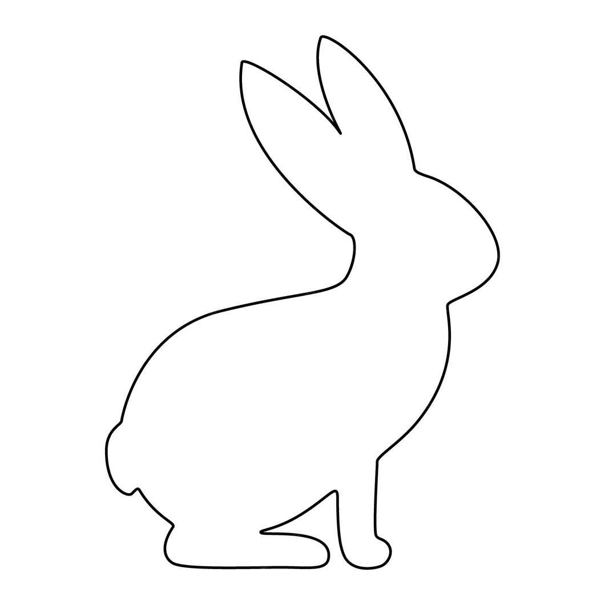
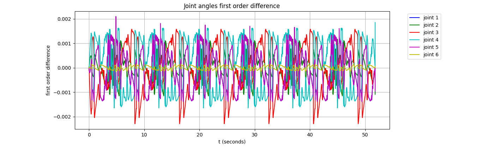
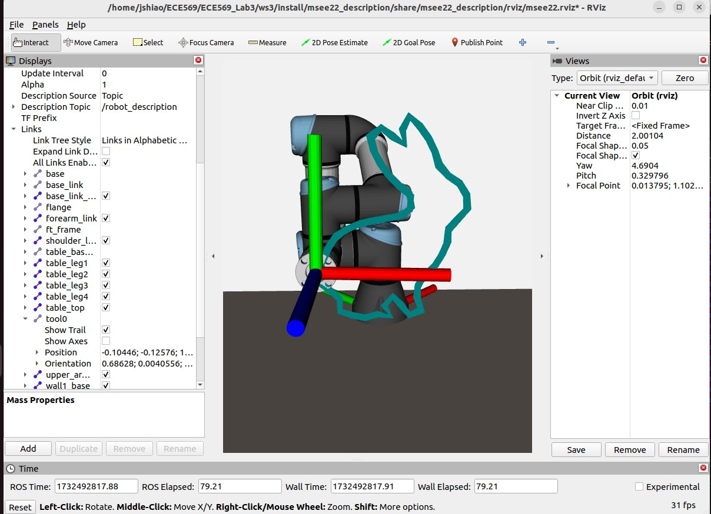
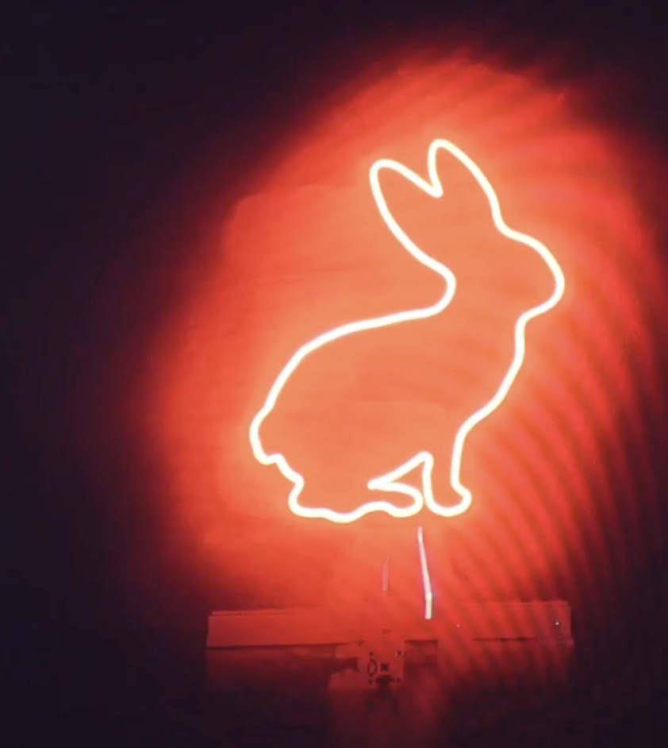

### Results:
| Source image | Inverse kinematics for UR3E |
| ------- | ------- |
|  |  |

| rViz simulation | trajectory execution |
| ------- | ------- |
|  |  |

### Reference: 
* [Making Formulas… for Everything—From Pi to the Pink Panther to Sir Isaac Newton](https://blog.wolfram.com/2013/05/17/making-formulas-for-everything-from-pi-to-the-pink-panther-to-sir-isaac-newton/)
